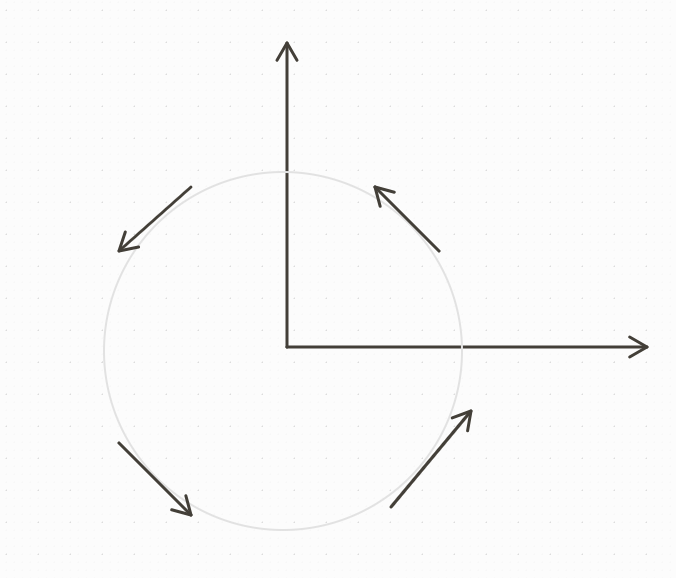

## Base Problem
$$\frac{dx}{dt} = f(x,y)$$
$$\frac{dy}{dt} = g(x,y)$$

Equilibrium Solution:
\begin{cases}
f(x^{*},y^{*}) = 0\\
g(x^{*},y^{*}) = 0
\end{cases}

Note:
$(x^{*},y^{*})$ is (S), (AS), and (NS).

When graphing in the $(x,y)$ plane (phase plane) trajectories, there are two things to note:
*Note 1: For each point, there is only one trajectory, and we'll graph them in parallel*
*Note 2: Only the equilibrium can reach equilibrium in finite time - a trajectory cannot*

There are three types of stability:
* Stable: When starting at a point, as t progresses, it stays close to that point.
* Unstable: When starting at a point, as t progresses, it goes away from that point.
* Asyomptotally Stable: When starting at any other point, it gets closer and closer.
	- ### Example
	  We are given the following base equations:
	  $$\frac{dx}{dt} = -y$$
	  $$\frac{dy}{dt} = x$$
	  
	  **1. Finding the equalibrium solution:**
	  \begin{equation}
	  \begin{cases}
	  -y = 0\\
	  x = 0
	  \end{cases}
	  = (0,0)
	  \end{equation}
	  
	  **2. Finding the DE:**
	  $$\frac{\frac{dy}{dt}}{\frac{dx}{dt}}=\frac{x}{-y}$$
	  $$\text{or}$$
	  $$\frac{dy}{dx} = \frac{-x}{y} \text{(separable equation)}$$
	  $$\text{so}$$
	  $$\frac{y^2}{2} = -\frac{x^2}{2} + C$$
	  $$\text{so (recognizing that this is the equation of a circle)}$$
	  $$x^2 + y^2 + C$$
	  This is a circle with center $(0,0)$ and radius $\sqrt{C}$.
	  
	  **3. Graphing:**
	   
	  Considering the four quadrants:
	  
	  QI, where x > 0 and y > 0:
	  $\frac{dx}{dt} = -y$ - since y is positive, $\frac{dx}{dt} < 0$
	  $\frac{dy}{dt} = x$ - since x is positive, $\frac{dy}{dt} > 0$
	  QII, where x < 0 and y > 0:
	  $\frac{dx}{dt} = -y$ - since y is positive, $\frac{dx}{dt} < 0$
	  $\frac{dy}{dt} = x$ - since x is negative, $\frac{dy}{dt} < 0$
	  QIII, where x < 0 and y < 0:
	  $\frac{dx}{dt} = -y$ - since y is negative, $\frac{dx}{dt} > 0$
	  $\frac{dy}{dt} = x$ - since x is negative, $\frac{dy}{dt} < 0$
	  QIV, where x > 0 and y < 0:
	  $\frac{dx}{dt} = -y$ - since y is negative, $\frac{dx}{dt} > 0$
	  $\frac{dy}{dt} = x$ - since x is positive, $\frac{dy}{dt} > 0$
	  
	  **4. Stability of (0, 0):**
	  We consider $(0,0)$ stable (S), because any trajectory that starts close to $(0,0)$ will stay close $(0,0)$.
	- ### Example 2
	  \begin{cases}
	  \frac{dx}{dt}=-x\\
	  \frac{dy}{dt}=2y
	  \end{cases}
	  
	  Finding the equilbrium:
	  \begin{equation}
	  \begin{cases}
	  -x=0\\
	  2y=0
	  \end{cases} \rarr (0,0)
	  \end{equation}
	  
	  Finding $\frac{dy}{dx}$:
	  $$\frac{\frac{dy}{dt}}{\frac{dx}{dt}}=\frac{dy}{dx}=-\frac{2y}{x}$$
	  $$\text{or}$$
	  $$\$$