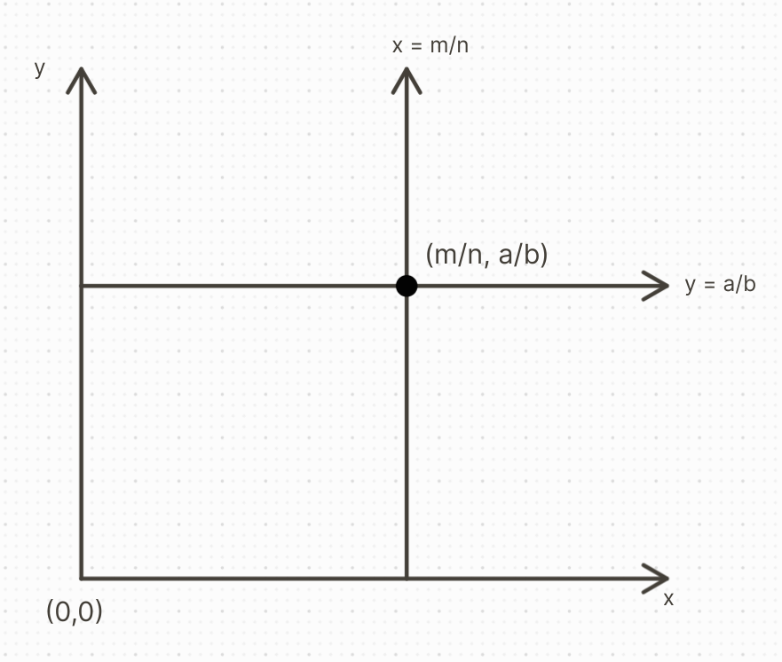
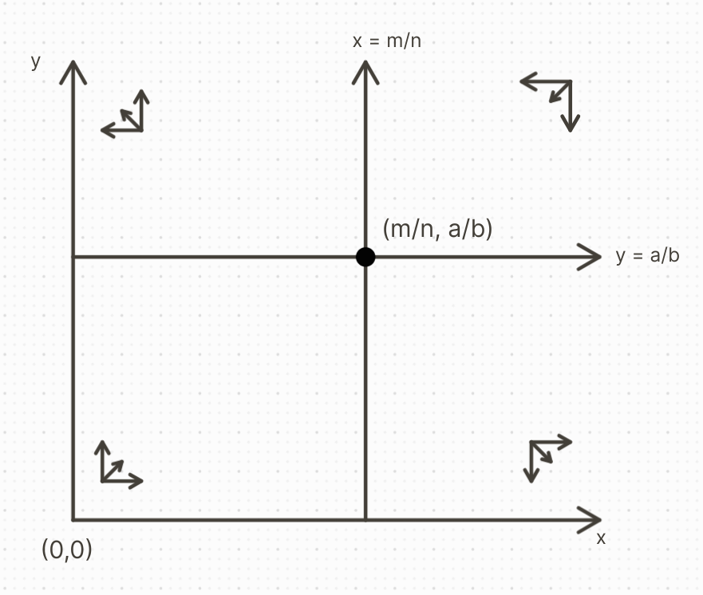

## Base Problem
Trout and bass in a pond, compete for resources. Determine the long-term outcome and coexistence, at least one will become extinct. How is the outcome related to the initial population?

Let $x(t)$ be the trout population at $t \geq 0$.
Let $y(t)$ be the bass population at $t \geq 0$.

**Assumptions**:
For the trout **without** the bass ($a > 0$), the rate of change per individual is:
$$\frac{dx}{dt} = ax(t)$$
$$\frac{dy}{dt} = my(t)$$

For the the two models **with** the bass ($a > 0$) the rate of change is reduced by $bxy$:
$$\frac{dx}{dt} = ax - bxy \text{ where }a,b >0$$
$$\frac{dy}{dt} = my - nxy \text{ where } m, n > 0$$
	- ### Deriving the equilibrium solutions:
	  \begin{cases}
	  \frac{dx}{dt} = ax - bxy = x(a - by)\\
	  \frac{dy}{dt} = my - nxy = y(m - nx)
	  \end{cases}
	  \begin{cases}
	  (1) | x(a - by) = 0\\
	  (2) | y(m - nx) = 0
	  \end{cases}
	  $$\therefore$$
	  $$(0,0) \text{ and } (\frac{m}{n},\frac{a}{b})$$
	- ### Deriving the base differential equation:
	  $$\frac{dy}{dx} = (\frac{m - nx}{x})(\frac{y}{a - by})$$
	  (she left solving as a *potential*? exercise)
	  
	  **Instructions**:
	  Solve the DE for trajectories. However, graphing will not be simple. You may try to graph with Matlab, Maple, etc with given values for $a, b, m, n$. Or, see the suggestions for Problem #7.
	- ### Graphing:
	  *See Fig. 12.3-12.8*
	  \begin{cases}
	  \frac{dx}{dt} = (a - by)x\\
	  \frac{dy}{dt} = (m - nx)y
	  \end{cases}
	  
	  
	  
	  Checking around each 'quadrant' around the non-zero equilibrium solution:
	  \begin{cases}
	  x < \frac{m}{n}, y < \frac{a}{b}: \frac{dx}{dt} > 0, \frac{dy}{dt} > 0\\
	  x > \frac{m}{n}, y < \frac{a}{b}: \frac{dx}{dt} > 0, \frac{dy}{dt} < 0\\
	  x > \frac{m}{n}, y > \frac{a}{b}: \frac{dx}{dt} < 0, \frac{dy}{dt} < 0\\
	  x < \frac{m}{n}, y > \frac{a}{b}: \frac{dx}{dt} < 0, \frac{dy}{dt} > 0
	  \end{cases}
	  
	  Rendering these movements onto the graph:
	  
	- ### Classifying stability of the equilibrium solution:
	  Both are not stable. Points that start close do not stay close, therefore, they are both unstable.
	- ### Interpreting the model:
	  **Stipulation 1**:
	  If the (IC) (x_0,y_0$) is close to (0,0), trajectory will move away as t \rarr \infty.
	  **Stipulation 2**:
	  Only trajectories that start on $L (\neq (0,0))$ will approach $(\frac{m}{n},\frac{a}{b})$ as $t \rarr \infty$.