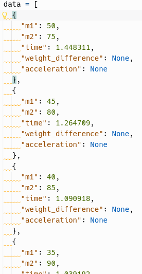
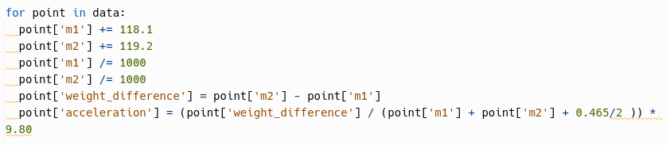
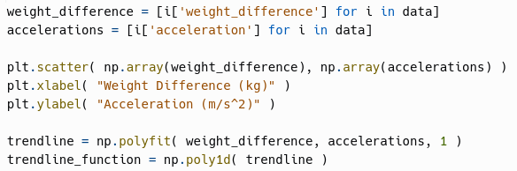
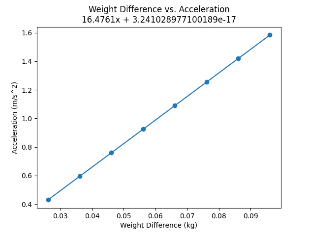
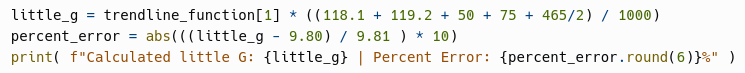
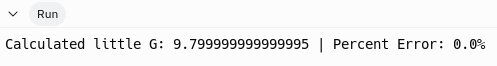

public:: true

- ### Metadata
  Date: *October 10, 2023*
  Class: *PHYS253 - Section 1*
  Author: *John White*
  Professor: *Jarod Adelman*
- # Theory
	- ## Primary Objectives
	  In this lab, we will...
	  * Measure the relationship between mass difference between a two-weight pulley system
	  * Calculate little G by the trendline of the relationship between weight difference and time
	  * Calculate the error percentages between a calculated and measured value
- # Data
	- ## 2.1
	  Weight 1: 118.2
	  Weight 2: 119.1g
	  Pulley: 465g
	  Distance between photogates: 64.5cm
	  
	  | Weight - Mass 1 (g) | Weight - Mass 2 (g) | Time (s) |
	  | 50 | 75 | 1.448311 |
	  | 45 | 80 | 1.264709 |
	  | 40 | 85 | 1.0909185 |
	  | 35 | 90 | 1.039192 |
	  | 30 | 95 | 0.9988435 |
	  | 25 | 100 | 0.9724234 |
	  | 20 | 105 | 0.936344 |
	  | 15 | 110 | 0.908686 |
	- ...
- # Results
	- # Preface
	  I decided to format my data as follows in a ``data`` variable:
	  
	- ## 3.1 Calculating Acceleration
	  I achieve this by first adding the mass of the weights themselves and converting to kilograms. Next, I populate the ``weight_difference`` field, and finally I calculate and populate the ``acceleration`` field with the equation $$a = \frac{m_2 - m_1}{m_2 + m_1 + \frac{m_p}{2}}g$$
	  
	- ## 3.2 Graphing the data
	  I then plot the data. I extract the data from each point into a list using a shorthand tactic called *list comprehension*.
	  
	  My graph looks the following way:
	  
	- ## 3.3 Collecting the Slope and Calculating Little G
	  I do this by grabbing the coefficient of the slope ($$m$$) and reversing the equation $$a = \frac{m_2 - m_1}{m_2 + m_1 + \frac{m_p}{2}}g$$ to solve for $$g$$.
	  
	  The following code does so, as well as calculating the percent error between real little g: 
	  
	  And finally, I get the following results: 
	  
- # Discussion
	- ### What would happen if we did not change the mass m1 at the same time as m2 ? (In other words, what if we kept m1 constant and just added mass to m2 ) Would the ultimate result change? Why or why not?
	  The ultimate results would not change, however the data would be reduced in extremity, because the weight difference would be lower. The acceleration would still be correct.
	- ### Consider the scenario of releasing the cylinder above the photogates (say 10 cm above). Would this affect the results that you would get? If so, how could you account for this effect (other than releasing the cylinder at the photogate)?
	  Yes, it would affect the results. Your time constant would not be as correct, as it would come in with a $$v_i \neq 0$$. This would lower the time to pass the second gate. You could counter this by adjusting your acceleration equation to calculate with a $$v_i\neq 0$$.
	- ### Describe what would happen if the friction within the pulley was not negligible. In other words, how would the system act if the pulley was not ideal or close to ideal?
	  It would require more of a weight difference to create a gravitational force large enough to create a net vertical force greater than zero.
- # Conclusion
  ...