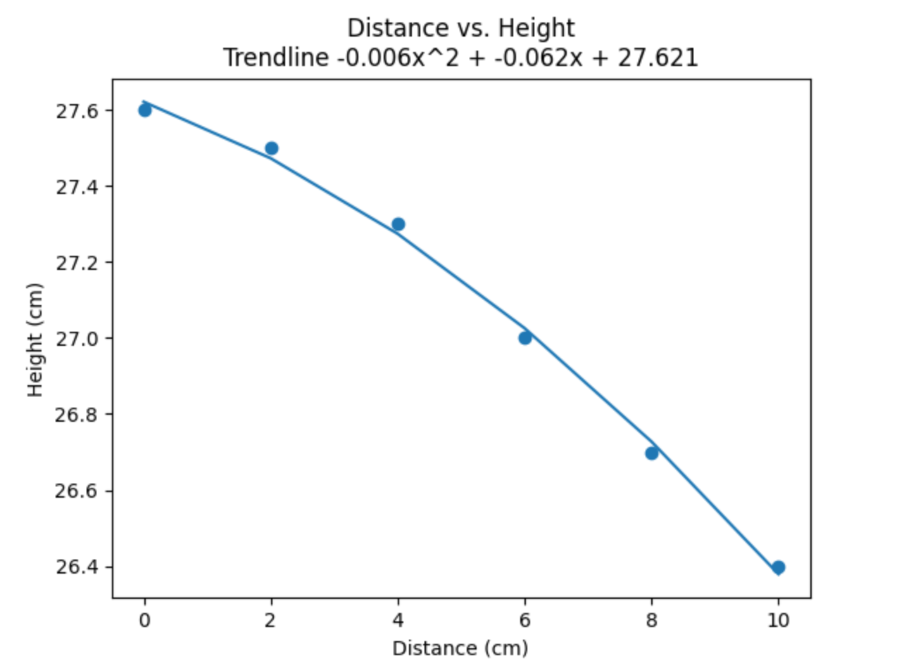
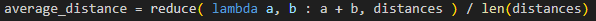
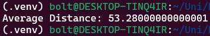
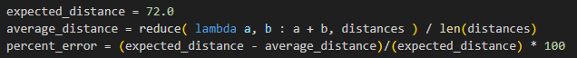
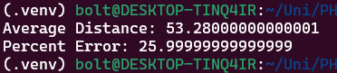

public:: true

- ### Metadata
  Date: *November 5th, 2023*
  Class: *PHYS253 - Section 1*
  Author: *John White*
  Professor: *Jarod Adelman*
- # Theory
	- ## Primary Objectives
	  In this lab, we will...
	  * -
	  * -
	  * -
- # Data
	- ## 2.1 Experimental Procedure
	  | Trial | Height |
	  |0cm|27.6|
	  |2cm|27.5|
	  |4cm|27.3|
	  |6cm|27.0|
	  |8cm|26.7|
	  |10cm|26.4|
- # Results
	- ## 3.1 Part A
	  Data Graph:
	   
	  I will discuss the relations between equation 4 and the trendline from this graph in **Discussion**.
	  
	  |I calculated the average distance via Python:
	  
	  Result:  
	  
	- ## 3.2 Part B
	  I also calculated the percent error in Python with the following code:
	  
	  Result: 
	  
- # Discussion
	- ## 4.1 Part 1
	  I was tasked to increase the distance between the exit point and the hit point.
	  
	  As the distance increases, the ball has more room to drop further, exponentially so, which lines up with Equation 4.
	  
	  This is visible in the data as well as the graph, as the line is inversely exponential in nature.
	- ## 4.2 Part 2
	  There is noticeable error between the expected range and there average range. The range points do actually increase slightly as time goes on, which may be the ball wearning down the tube and reducing the friction, allowing it to fly farther.
	  
	  Ultimately, our photogates were broken, so our TA suggested that we use the expected range of another table. However, their photogates were not at the end of the tube - a bad idea, because this means that the average velocity is not accurate since it will slow down by the time it exits the tube. 
	  
	  These two factors result in a relatively high percent error (25%).
- # Conclusion
  I believe that this was a very interesting lab, and I found it cool to be able to see the derivation of real-life equations and how they play out. Often, I have a hard time visualizing non-sinusoidal functions, especially exponential functions of the second or third order - but this lab has helped with that.
  
  I do believe that the lab's methodology needs to be changed. Our tube was too dirty for the photogates to be able to actually see the ball, meaning the lab is fundamentally flawed and many groups will have issues. This can be solved by exempting the top half or bottom two-thirds of the tube,  removing the translucent barrier between the photogates and the ball. This may also result in more accurate data, as buildup on those now-gone sides is not possible to slow down the ball.