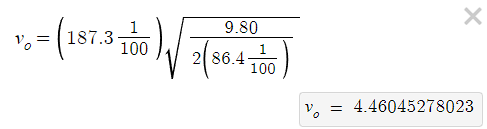
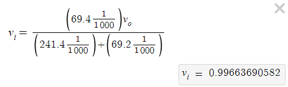
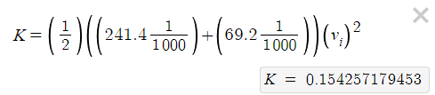
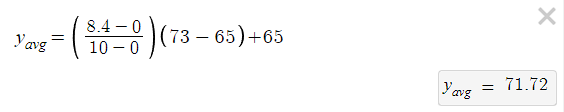
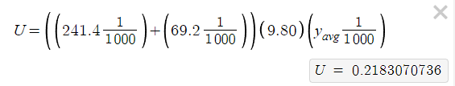

public:: true

- ### Metadata
  Date: *October 10, 2023*
  Class: *PHYS253 - Section 1*
  Author: *John White*
  Professor: *Jarod Adelman*
- # Theory
	- ## Primary Objectives
	  In this lab, we will...
	  * Practice equation substitution to solve for different variables in terms of other variables
	  * 
	  * Calculate the error percentages between a calculated and measured value
- # Data
	- ## ...
		- ## ...
		  Distance from x_i to x_f: 187.3cm
		  Distance from y_f to x_i: 86.4cm
		  Weight of the cup: 241.4g
		  Weight of the ball: 69.2g
		  
		  Number of notches: 
		  T1: 6
		  T2: 6
		  T3: 8
		  T4: 9
		  T5: 6
		  T6: 10
		  T7: 11
		  T8: 10
		  T9: 9
		  T10: 9
		  **Average:** (6+6+8+9+6+10+11+10+9+9) / 10 = 8.4 notches
- # Results
	- ### 3.1 Initial Velocity
	  The initial velocity of the ball is 4.46m/s.
	- ### 3.2 $K_E$ of the Ball/Cup Combined System
	  The kinetic energy of the ball and the cup combined system is 0.154J
	- ### 3.3 Height For Average Notches
	  The height for the average number of notches can be calculated to be 71.72mm.
	- ### 3.4 Potential Energy
	  The potential energy at the height of the average number of notches can be found to be 0.218J.
	- ### 3.5 Percent Difference
	  The percent difference obtained form this lab was 34.4%.
- # Discussion
	- #### 4.1 Initial Velocity
	  I was tasked with finding the initial velocity first of only the ball being shot from the ballistic spring.
	  
	  I obtained the initial velocity by solving for V_o in the range equation ($$R=v_o\sqrt{\frac{2h}{g}}$$) to get and use the following equation.
	  
	- ### 4.2 $K_E$ of the Ball/Cup Combined System
	  Next, I needed to find the velocity of the combined system once the ball collides with the cup.
	  
	  I do this with the formula $$v_i=\frac{m_bv_o}{m_b+m_c}$$, substituting $$v_o$$ from the previous step in as follows:
	  
	  ...and next plugging this into the formula for kinetic energy ($$K_E = \frac{1}{2}(m_1+m_2)v_i^2$$)
	  
	- ### 4.3 Height for Average Notches
	  I deduce the height for the average notches by **interpolation**, since no data point matches the average that we recieved.
	  
	  I used the following interpolation formula: $$\frac{x-n_1}{n_2-n_1} = \frac{y-h_1}{h_2-h_1}$$, and substituted in the average notches listed above in **Data 2.1**:
	  
	- ### 4.4 Potential Energy at the Average Height
	  This was an interesting thing to find, as for our group, our potential energy was higher than our initial kinetic energy. We believe this is because we did not redo our range tests when we switched our ball after our ball wasn't pushing enough notches.
	  
	  I believe that if we had redone our range tests, our potential energy would have been less due to work done by friction of the pendulum hinge.
	  
	  Regardless, I calculated $$U$$ with the equation $$U=(m_1+m_2)gh$$, substituting in the values that we found as follows:
	  
	- ### 4.5 Percent Difference
	  Percent difference is calculated using the standard formula $$\%_{diff} = \frac{K-U}{\frac{1}{2}. (K+U}*100\%$$
- # Conclusion
  ...