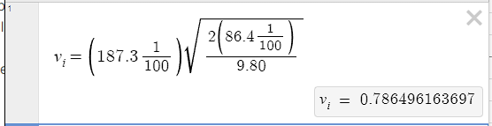

public:: true

- ### Metadata
  Date: *October 10, 2023*
  Class: *PHYS253 - Section 1*
  Author: *John White*
  Professor: *Jarod Adelman*
- # Theory
	- ## Primary Objectives
	  In this lab, we will...
	  * Practice equation substitution to solve for different variables in terms of other variables
	  * 
	  * Calculate the error percentages between a calculated and measured value
- # Data
	- ## ...
		- ## ...
		  Distance from x_i to x_f: 187.3cm
		  Distance from y_f to x_i: 86.4cm
		  Weight of the cup: 241.4g
		  Weight of the ball: 69.2g
		  
		  Number of notches: 
		  T1: 6
		  T2: 6
		  T3: 8
		  T4: 9
		  T5: 6
		  T6: 10
		  T7: 11
		  T8: 10
		  T9: 9
		  T10: 9
		  **Average:** (6+6+8+9+6+10+11+10+9+9) / 10 = 8.4 notches
- # Results
	- ### 3.1 Initial Velocity
	  The initial velocity of the ball is 4.46m/s.
	- ### 3.2 K_E of the Ball/Cup Combined System
	  The kinetic energy of the ball and the cup combined system is 0.154J
	- ### 3.3 Height For Average Notches
	  The height for the average number of notches can be calculated to be 71.72mm.
	- ### 3.4 Potential Energy
	  The potential energy at the height of the average number of notches can be found to be 0.218J.
	- ### 3.5 Percent Difference
	  The percent difference obtained form this lab was
- # Discussion
	- ## 3.1 Initial Velocity
	  
- # Conclusion
  ...