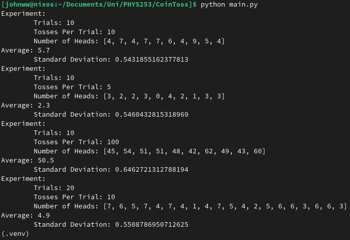

## Metadata
Date: *September 12, 2022*
Class: *PHYS253 - Section 1*
Author: *John White*
Professor: *Jarod Adelman*
- # Theory
	- ## Primary Objectives
	  * Learn to convert between typical units while adhering to the laws of significant figures
	  * Determine the number of people working in the Willis Tower
	  * Calculate the water usage of the Willis Tower in liters per minutes.
- # Data
  |Group|Usable Area ($$m^2$$)|Workers|Water Usage ($$\frac{liters}{min}$$)|
  |------|:------------------------:|:-------:|-------------------------------------:|
  |1|123000|176000|46800|
  |2|367357|58000|15000|
  |3|533000|106000|28000|
  |4|4.0e5|1.0e5|2.6e4|
  |5|369000|94000|24000|
  *Table 1: Final resultant data extracted from each group*
- # Data
	- ## 2.1 Coin Toss
		- #### 2. Results
		  
	- ## 2.2 Table Measurements
	  Length: 92cm
	  Width: 183cm
- # Results
	- ## 3.2 Table Measurements
		- #### 1.) Calculating the Perimeter and Area
		  Perimeter = 5.5e2cm
		  Area = 1.7e4cm
		- #### 2.)
- # Discussion
  I believe that the area of the base I calculated is relatively accurate, since the numbers are pulled from their website, and the only way to have error would be small portions that could jutt in or out. 
  
  However, I do have concerns with how I calculated the usable area, as 7/9th (or 14/18ths) of a given floor being usable is a serious estimate. There are many factors, such as breathing room for cubicles and the walkways between them, lounges, etc.
  
  Not knowing the size of cubicles also drastically reduces the accuracy and ability to calculate the number of employees, however, because the Willis Tower states there are 15000 employees, and by my estimates I calculated around 10000. This could be because I chose a different cubicle size, but I also believe I should have been more lenient with my multiplier of available space (currently 1/3rd), as only a third of a floor being usable is a bit of a rough estimate.
  
  In relation to calculating the actual daily water usage, I don't see how a worker could use 100 gallons of water a day in the slightest. Maybe 2-10 gallons, accounting for water fountains; sinks; and restrooms, but not 100. Therefore, I do not believe that the total water usage is accurate.
  
  However, there was another group which was completely separate from us, and reached a very similar final answer. This leads me to believe that our reasoning and final answer are sound considering the information we were provided.
- # Conclusion
  I enjoyed overcoming my fear of converting units. It was previously something I hated from AP Chem, and never worked out, but I was able to deduce my own quick method of converting units while maintaining readability and usability. I did not particularly enjoy having to 'create' constants, as this leaves significant room for error. It also eliminates the ability to differentiate between errors when comparing to other people, unless you choose to agree on constants.
  
  There was no theory for this lab, but the objectives provided were all completed.
  
  I did enjoy this lab, I believe it helped with my unit conversion skills significantly. Besides providing solely genuine constants, I would not change anything for future iterations.