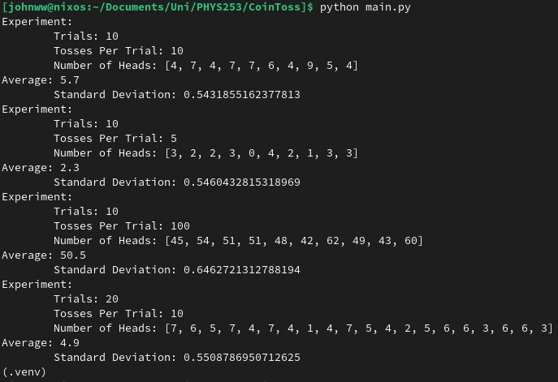

## Metadata
Date: *September 12, 2022*
Class: *PHYS253 - Section 1*
Author: *John White*
Professor: *Jarod Adelman*
- # Theory
	- ## Primary Objectives
	  * Learn to convert between typical units while adhering to the laws of significant figures
	  * Determine the number of people working in the Willis Tower
	  * Calculate the water usage of the Willis Tower in liters per minutes.
- # Data
	- ## 2.1 Coin Toss
		- #### 2. Results
		  I will be omitting the data section, as the data is generated each run by my code.
		  
		  This allows for
	- ## 2.2 Table Measurements
	  Length: 92cm
	  Width: 183cm
- # Results
	- ## 3.1 Coin Toss
	  
	- ## 3.2 Table Measurements
		- #### 1.) Calculating the Perimeter and Area
		  Perimeter = 5.5e2cm
		  Area = 1.7e4cm
		- #### 2.)
- # Discussion
  ~~
- # Conclusion
  ~~