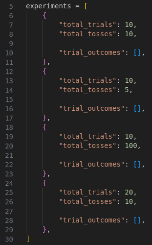
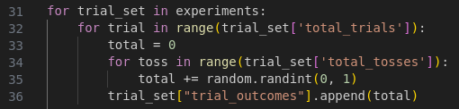
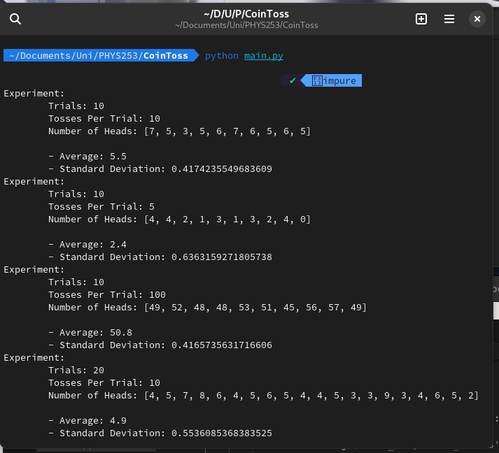

## Metadata
Date: *September 12, 2022*
Class: *PHYS253 - Section 1*
Author: *John White*
Professor: *Jarod Adelman*
- # Theory
	- ## Primary Objectives
	  * Learn to convert between typical units while adhering to the laws of significant figures
	  * Determine the number of people working in the Willis Tower
	  * Calculate the water usage of the Willis Tower in liters per minutes.
- # Data
	- ## 2.1 Coin Toss
		- #### 2. Results
		  I will be omitting the data section, as the data is generated each run by my code.
		  
		  This allows for
	- ## 2.2 Table Measurements
	  Length: 92cm
	  Width: 183cm
- # Results
	- ## 3.1 Coin Toss
		- ### 3.1.1 Data Template
		  I first decided to omit the manual entry nature, I would rather instead calculate new data on each run - this helps to omit outliers.
		  
		  I started with an array (list, for python'ers), with an entry for each of the 4 experiments. I accordingly titled it ``experiments``.
		  
		  For each entry of ``experiments`` (each experiment, if you will), I included an object (dict, in python). There are 2 constants: ``total_trials``; which is the number of trials to run for that experiment, and ``total_tosses``; which is the number of tosses for each trial. There is also an array (list) adequately titled ``trial_outcomes``, which is an array to which each result from each trial is appended to.
		  
		  After filling in the constants according to the lab, this is the resulting dataset template:
		  
		- ### 3.1.2 Data Generation
		  Now, to populate each of the ``trial_outcomes``, we must first iterate each experiment. Following this, we must iterate through each trial. And finally, we must iterate through each coin toss, and add the resulting coin toss to a counter.
		  
		  After the final coin toss, this counter is appended to its corresponding ``trial_outcomes``.
		  
		  The code for this section looks as such:
		  
		- 
	- ## 3.2 Table Measurements
		- #### 1.) Calculating the Perimeter and Area
		  Perimeter = 5.5e2cm
		  Area = 1.7e4cm
		- #### 2.)
- # Discussion
  ~~
- # Conclusion
  ~~