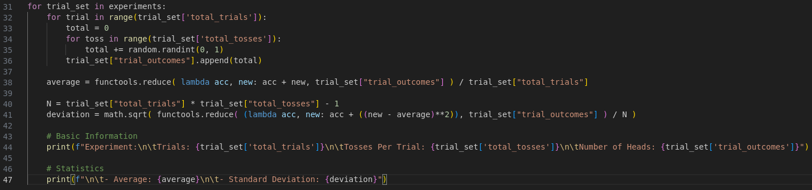

### Metadata
Date: *September 21, 2022*
Class: *PHYS253 - Section 1*
Author: *John White*
Professor: *Jarod Adelman*
- # Theory
	- ## Primary Objectives
	  * ~~
	  * ~~
	  * ~~
- # Data
	- ## 2.1 Coin Toss
	  I will be omitting the data section, as the data is generated each run by my code. Please see **3.1 Coin Toss** for an in-depth explanation.
	- ## 2.2 Table Measurements
	  Length: 92.3\plusmn0.1cm
	  Width: 183.8\plusmn0.1cm
- # Results
	- ## 3.1 Coin Toss
		- ### 3.1.1 Data Template
		  I first decided to omit the manual entry nature, I would rather instead calculate new data on each run - this helps to omit outliers.
		  
		  I started with an array (list, for python'ers), with an entry for each of the 4 experiments. I accordingly titled it ``experiments``.
		  
		  For each entry of ``experiments`` (each experiment, if you will), I included an object (dict, in python). There are 2 constants: ``total_trials``; which is the number of trials to run for that experiment, and ``total_tosses``; which is the number of tosses for each trial. There is also an array (list) adequately titled ``trial_outcomes``, which is an array to which each result from each trial is appended to.
		  
		  After filling in the constants according to the lab, this is the resulting dataset template:
		  
		- ### 3.1.2 Data Generation
		  Now, to populate each of the ``trial_outcomes``, we must first iterate each experiment. Following this, we must iterate through each trial. And finally, we must iterate through each coin toss, and add the resulting coin toss to a counter.
		  
		  After the final coin toss, this counter is appended to its corresponding ``trial_outcomes``.
		  
		  The code for this section looks as such:
		  
		- ### 3.1.3 Calculating the Averages
		  For each dataset, I am required to present the average between all trials per experiment.
		  
		  Logically, to do so, we must first iterate each experiment, and then calculate after the data is generated. Therefore, I place the calculation in the first level loop after the data is found.
		  
		  Calculating the average itself is as simple as adding all elements of the ``trial_outcomes`` and dividing by the number of flips, which is ``total_trials * total_tosses``.
		  
		  In Python, using the ``reduce`` function on a list reduces each element to a starting accumulator. By using a basic ``lambda`` function which adds each new element to said accumulator, the following code correctly calculates the average ()and stores it in ``average`` for later data logging):
		  
		- ### 3.1.4 Calculating the Standard Deviation
		  We can start by calculating the bottom half of the inner fraction of the formula for standard deviation. This is accomplished by subtracting 1 from the total number of tosses, ``total_trials * total_losses``.
		  
		  Accordingly: 
		  
		  
		  Next, to calculate the deviation itself, we must take the sum of each element minus the average square. Here, I use the same ``reduce`` function from before to do so - it calculates that formula and adds it to the accumulator.
		  
		  Finally, we must take the ``sqrt`` of the top divided by the bottom. Our final code follows:
		  
		- ### 3.1.5 Logging
		  Last, we need a way to interpret this data. I accomplish this with basic usage of the print function and Python's (strange) syntax for string interpolation, and some escape characters for sake of line numbers:
		  
		  *Note: The print statements are split in favor of taking the screenshot.*
		- ### 3.1.6 Final Code and Results
		  **Code:**
		   
		  **Results:**
		  {:height 656, :width 713}
	- ## 3.2 Table Measurements
		- #### 1.) Calculating the Perimeter and Area
		  Perimeter = 552cm
		  Area = 1.7e4cm
		- #### 2.)
- # Discussion
  ~~
- # Conclusion
  ~~