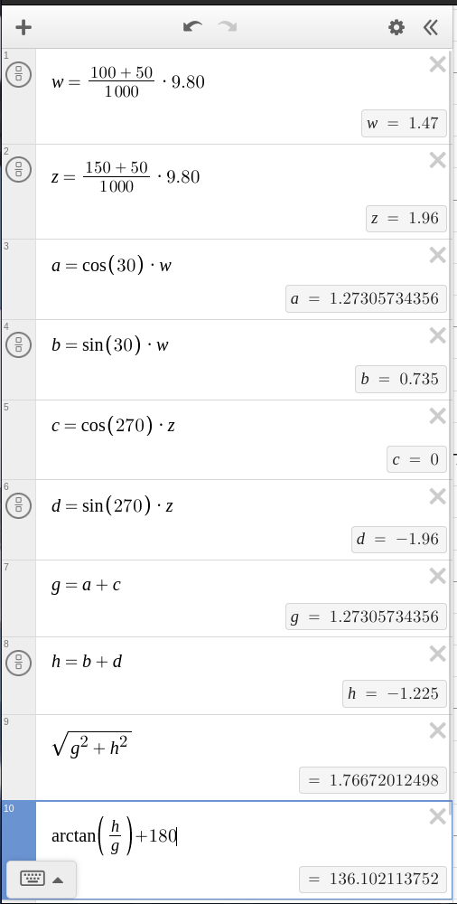

public:: true

- ### Metadata
  Date: *September 21, 2022*
  Class: *PHYS253 - Section 1*
  Author: *John White*
  Professor: *Jarod Adelman*
- # Theory
	- ## Primary Objectives
	  In this lab, we will...
	  * ~~
	  * ~~
	  * ~~
- # Data
	- ## 2.1 Vector X and Y components
	  ~~
- # Results
	- ## 3.1 Equilibrium Weight
	  First, I created a Desmos calculator to calculate the components of the final vector. **a** and **b** are the **x** and **y** components respectively of the first weight, and **c** and **d** are the **x** and **y** components of the second weight.
	  
	  **First two equations:**
	  These calculate the actual weight of each hook-weight system.
	  
	  **Equations 3-6:**
	  These calculate the **x** and **y** components of each system.
	  
	  **Equations 7-8:**
	  These two calculate the **x** and **y** components of the vector (the flip effect is not calculated, I do it manually to ensure my results are relevant.)
	  
	  **Equations 9-10:**
	  The first calculates the magnitude (N).
	  The second calculates the angle (deg), but 180 still needs to be added.
	  
	  
		- ### Section 1:
		  
			- calculator
		- ### Section 2:
		  tttt
		  
		- ### Section 3:
		  tttt
		  
- # Conclusion
  ~~