public:: true

- ### Metadata
  Date: *October 7th, 2023*
  Class: *PHYS253 - Section 1*
  Author: *John White*
  Professor: *Jarod Adelman*
- # Theory
	- ## Primary Objectives
	  In this lab, we will...
	  * Learn to use Python's graphing library, matplotlib
	  * Learn to draw trendlines and annotate R^2
	  * Learn the relationships between data, their trendlines, and what the trendlines represent
- # Data
  id:: 1c5fb815-bc82-43f4-b19d-a7e2f78794e1
	- ## 2.1 Data Per Angle
		- ### 2.1.1 Angle 1
		  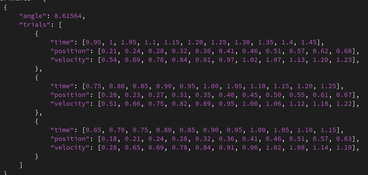
		- ### 2.1.2 Angle 2
		  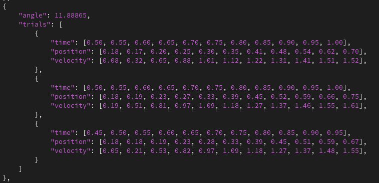
		- ### 2.1.3 Angle 3
		  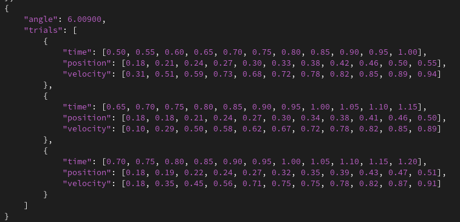
- # Results
	- ## 3.1 Analyzing the Angle Data
		- ### 3.1.1 Creating the Graph Generation Code
			- ### 3.1.1.1 Calculating the Angles
			  I calculate each of the angles using the following equation: 
			  $$arctan(\frac{h_2-h_1}{l})=\theta$$
			  
			  This data can be seen above in the ``angle`` field of each experiment.
			  
			  I structured my data in the following pattern:
			  **First:** ``experiments`` is an array of each ``angle``'s experiments.
			  **Second:** Each ``experiment`` contains an ``angle`` and a ``trials`` field.
			  **Third:** ``trials`` is an array of ``trial`` objects, containing a ``time``, ``position``, and ``velocity`` data array.
			- ### 3.1.1.2 Create Graphs For Position vs. Time and Velocity vs. Time
			  I accomplish this with the ``matplotlib`` library. 
			  
			  First, I iterate each of the experiments and trials: (I set aside the angle for later usage)
			  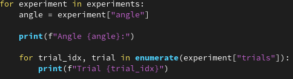
			  
			  Then, I build a basic graph for each: 
			  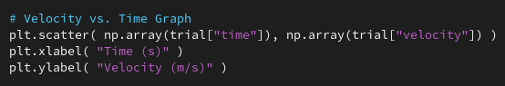
			  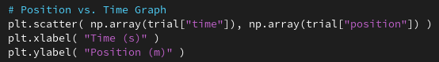
			- ### 3.1.1.3 Create a Trendline And Calculate $R^2$
			  I do this using the ``sklearn`` library, as they have a built-in $$R^2$$ function. I then plot them both.
			  
			  I use a polynomial line of degree 1, because while a second degree would be more accurate, I instead prefer the ease of calculation because the difference between the two in visual line representation is negligible.
			  
			  I then include both figures in the title of the graph.
			  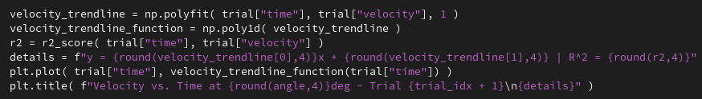
			- ### 3.1.1.4 Calculating Little G
			  I do this by extracting the coefficient from the trendline - the acceleration. I then calculate the percent error compared to the expected little g, which I find via ``little_g = 9.80 * sin(radians(angle))``.
			  
			  This is translated into code in the following way:
			  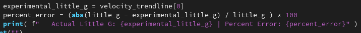
			   
			  Finally, I run my code - generating the graphs and the percent errors. Both are listed below.
			  **Angle Set 1:**
			  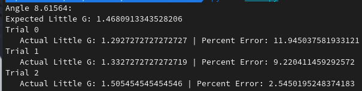
			  
			  **Angle Set 2:**
			  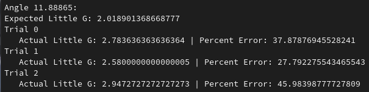
			  
			  **Angle Set 3:**
			  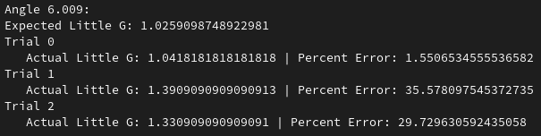
			  
			  **Graphs:**
			- #### Angle 6.009deg
				- #### Trial 1
				  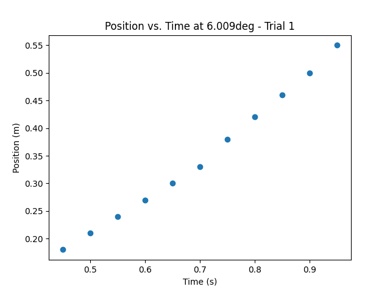
				  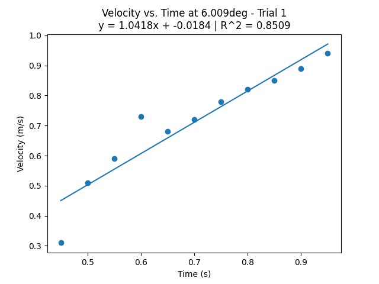
				- #### Trial 2
				  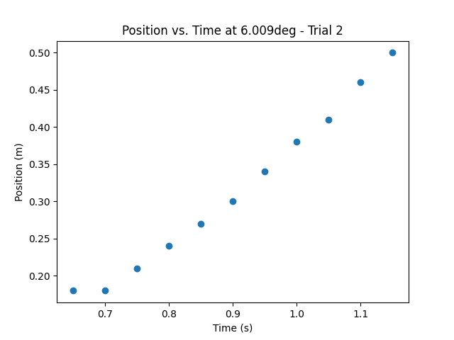
				  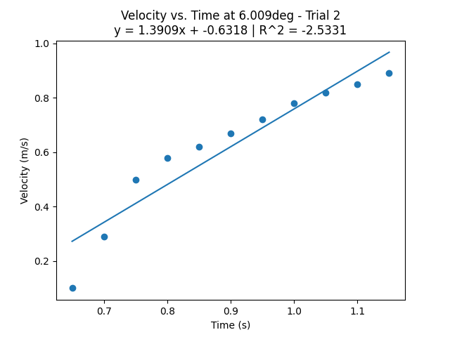
				- #### Trial 3
				  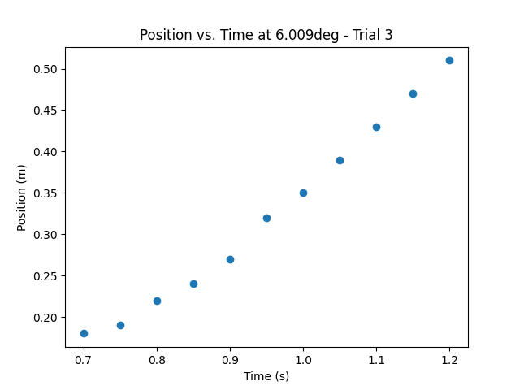
				  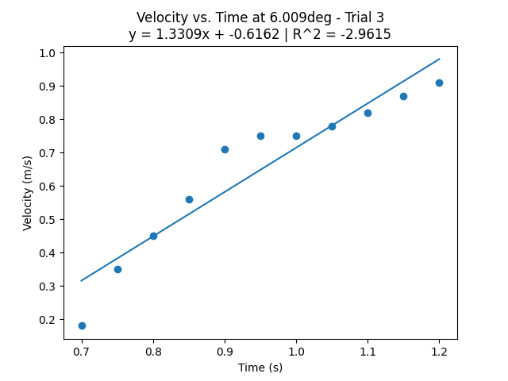
			- ### Angle 8.1654deg
				- #### Trial 1
				  
				  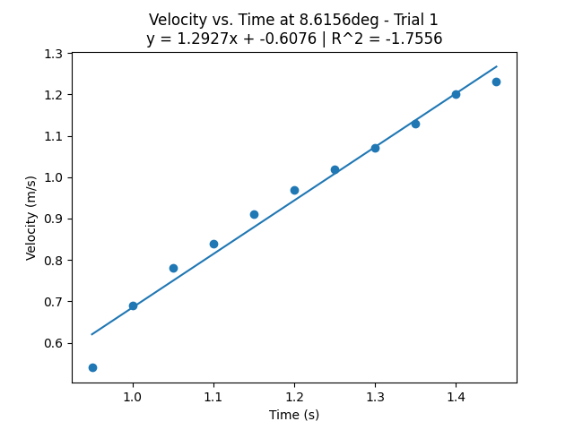
				- #### Trial 2
				  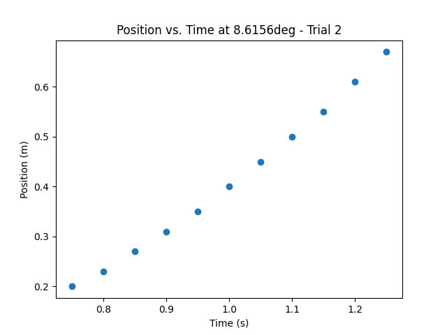
				  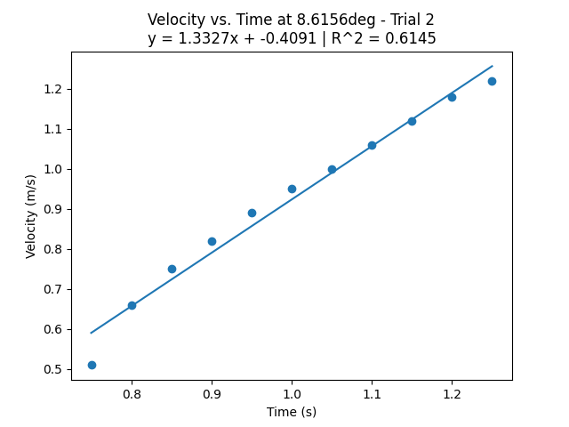
				- #### Trial 3
				  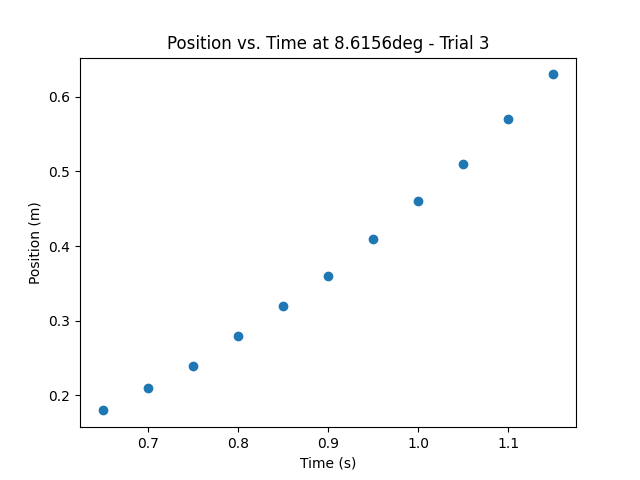
				  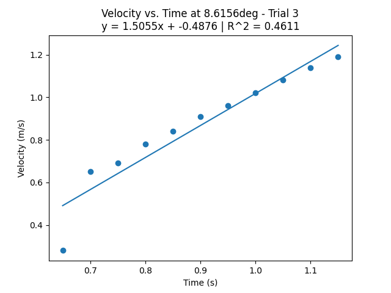
			- ### Angle 11.8887deg
				- #### Trial 1
				  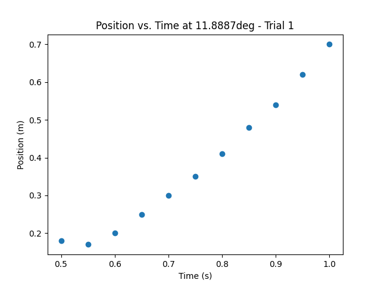
				  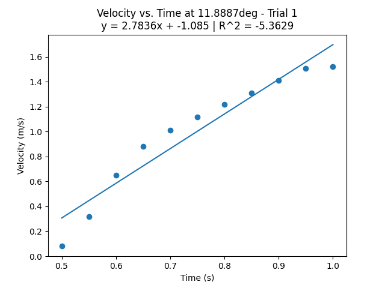
				- #### Trial 2
				  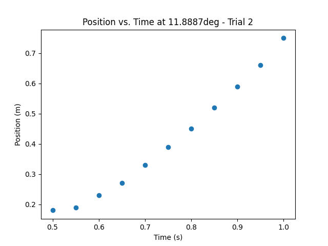
				  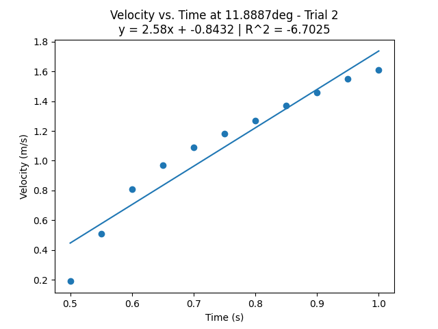
				- #### Trial 3
				  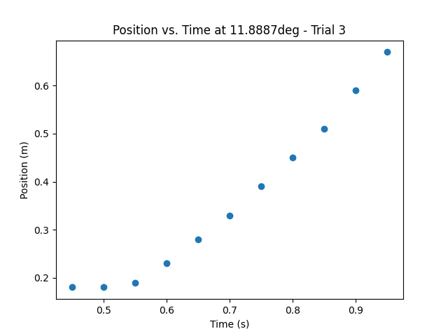
				  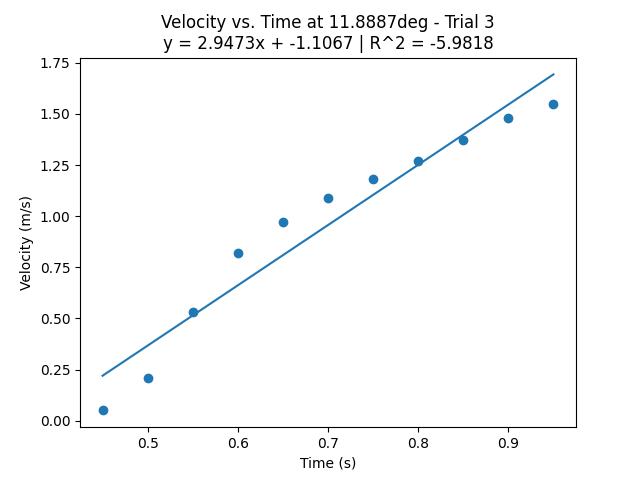
- # Discussion
  For the first task of calculating the angles, I do this by hand, solely because I wished to leave the angles in the ((1c5fb815-bc82-43f4-b19d-a7e2f78794e1)) section to easier distinguish data.
  
  My group actually recorded our data in an Excel spreadsheet, but I translated it to code because I wanted to instead to it with Python instead of Excel.
  
  Next, I used ``sklearn`` and ``matplotlib`` to plot a complete set of graphs. I decided to have it save each graph for ease of upload to this lab report.
  
  I finally decided to calculate the percent error with the calculated and experimental (trendline's x coefficient) and print it, this way I can view them after each run and verify that the data is correct by recalculating as necessary.
  
  There are high percent errors for my numbers, but they are relatively consistent. Therefore, I do not believe they are calculation error. I believe this has to do with the error in measurement of both the angle and the velocity - technological error and measurement error.
- # Conclusion
  I enjoyed this lab, and it was refreshing to use Python for the first time in a long while. I can't say I enjoy using it, but it's hard not to appreciate how little has to be written. It's prone to developer error and slow, but perfectly suited for fast statistical and mathematical computations. I did not enjoy the table section because I did not understand how the error propagation formulas were derived.
  
  I believe the theory was satiated.
  
  I used Python frequently prior, so considering that leaning it was likely the point of the lab, it's hard to say that I learned something substantial. I do think the lab was a success for others, as they seemed to learn a lot about Python through the slides linked on the course material section. I would add more explanation regarding the derivation of the error propagation formulas.