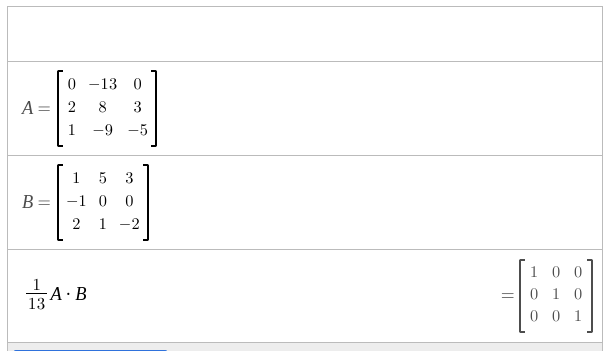

## 2x2
\begin{equation}
\frac{1}{ad-bc}\begin{bmatrix}a & b \\ c & d\end{bmatrix}
\end{equation}

Deriving:
\begin{vmatrix}
a & b & | & 1 & 0 \\
c & d & | & 0 & 1
\end{vmatrix}
$$\text{or}$$

\begin{vmatrix}
1 & b/a & | & 1/a & 0 \\
0 & d - bc/a & | & -c/a & 1
\end{vmatrix}
$$\text{or}$$

\begin{vmatrix}
1 & 0 & | & \frac{1}{a}-\frac{b}{a}(\frac{-c/a}{d-bc/a}) & \frac{-b}{a}(\frac{1}{d-bc/a}) \\
0 & 1 & | & \frac{-c/a}{d-bc/a} & \frac{1}{d-bc/a}
\end{vmatrix}$$
\text{or}$$
\begin{vmatrix}
1 & 0 & | & \frac{d}{ad-bc} & \frac{-b}{ad-bc} \\
0 & 1 & | & \frac{-c}{ad-bc} & \frac{a}{ad-bc}
\end{vmatrix}
- ## 3x3
  For a matrix like:
  \begin{bmatrix}
  a & b & c \\
  d & e & f \\
  g & h & i
  \end{bmatrix}
  
  \begin{cases}
  ax+by+cz=1 \\
  dx+ey+fz = 0 \\
  gx+hy+iz = 0
  \end{cases}
  
  ...and one for each basis vector! Instead, we'll set up a 2D version of Gaussian elimination.
  
  \begin{vmatrix}
  a & b & c & | & 1 & 0 & 0 \\
  d & e & f & | & 0 & 1 & 0 \\
  g & h & i & | & 0 & 0 & 1
  \end{vmatrix}
  
  For example:
  \begin{vmatrix}
  1 & 5 & 3 & | & 1 & 0 & 0 \\
  -1 & 0 & 0 & | & 0 & 1 & 0 \\
  2 & 1 & -2 & | & 0 & 0 & 1
  \end{vmatrix}
  $$\text{or}$$
  
  \begin{vmatrix}
  1 & 5 & 3 & | & 1 & 0 & 0 \\
  0 & 5 & 3 & | & 1 & 1 & 0 \\
  0 & -9 & -8 & | & -2 & 0 & 1
  \end{vmatrix}$$
  \text{or}$$
  
  \begin{vmatrix}
  1 & 0 & 0 & | & 0 & -1 & 0 \\
  0 & 1 & 0 & | & 2/13 & 8/13 & 3/13 \\
  0 & 0 & 1 & | & 1/13 & -9/13 & -5/13
  \end{vmatrix}
  
  Congrats! You found the inverse for that arbitrary matrix. However, you **must** verify it afterwards by **multiplying out the two matrices**:
  
	- ## Finding the Determinant
	  $$\det\left(A\right)=aei+bfg+cdh-gec-hfa-dbi$$
	  $$\text{or}$$
	  $$=a\left(ei-fh\right)-b\left(di-fg\right)+c\left(dh-eg\right)$$
	  $$\text{or}$$
	  $$=-b\left(di-fg\right)+e\left(ai-bg\right)-h\left(af-cd\right)$$
- ## Additional Notes
  It's heavily worth noting that if the Gaussian process aborts, then it means that A is not invertible!
  
  The determinant of the identity matrix is $1$.
- ## Is $\det\left(AB\right)=\det\left(A\right)\cdot\det\left(B\right)$?
  meow