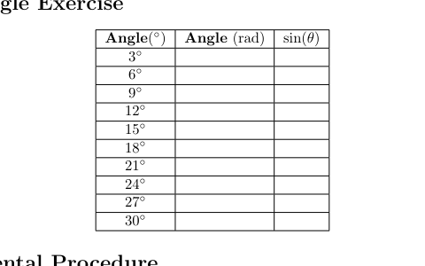

public:: true

- ### Metadata
  Date: *November 28, 2023*
  Class: *PHYS253 - Section 1*
  Author: *John White*
  Professor: *Jarod Adelman*
- # Theory
	- ## Primary Objectives
	  In this lab, we will...
	  * Practice equation substitution to solve for different variables in terms of other variables
	  * 
	  * Calculate the error percentages between a calculated and measured value
- # Data
	- ## ..
	  
- # Results
	- ## 3.1 ...
	  ...
- # Discussion
  ...
- # Conclusion
  ...