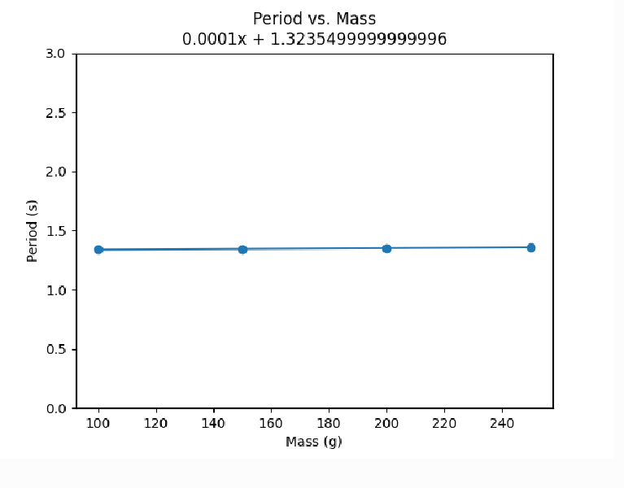
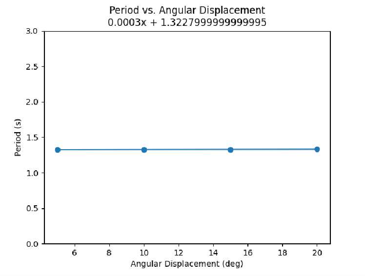
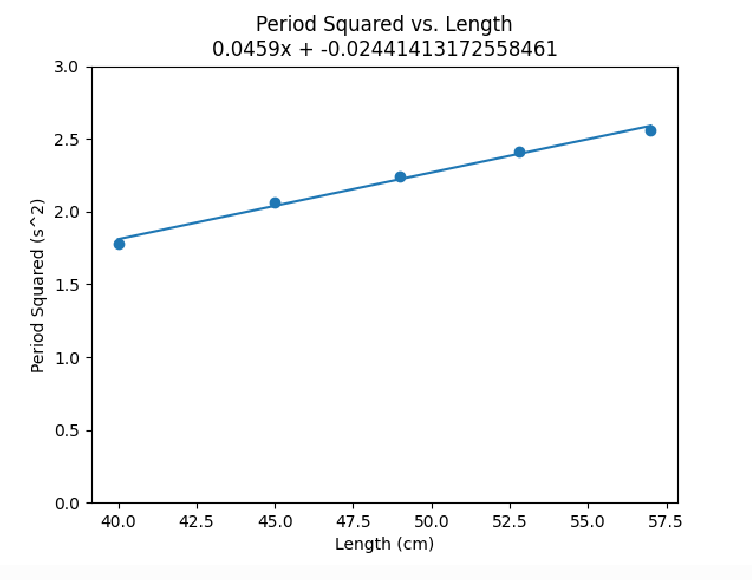

public:: true

- ### Metadata
  Date: *November 28, 2023*
  Class: *PHYS253 - Section 1*
  Author: *John White*
  Professor: *Jarod Adelman*
- # Theory
	- ## Primary Objectives
	  In this lab, we will...
	  * Practice equation substitution to solve for different variables in terms of other variables
	  * 
	  * Calculate the error percentages between a calculated and measured value
- # Data
	- ## Angular Exercise
	  |**Angle (deg)**|**Angle (rad)**|**sin(theta)**|
	  |3|0.05|0.05|
	  |6|0.10|0.10|
	  |9|0.16|0.16|
	  |12|0.21|0.21|
	  |15|0.26|0.26|
	  |18|0.31|0.31|
	  |21|0.37|0.36|
	  |24|0.42|0.41|
	  |27|0.47|0.45|
	  |30|0.52|0.50|
	- ## Period vs. Mass
	  |**Mass (g)**|**Avg Period (s)**|
	  |100|1.3384|
	  |150|1.3444|
	  |200|1.3464|
	  |250|1.3606|
	  
	- ## Period vs. Angular Displacement
	  |**Angle (\deg)**|**Period (s)**|
	  |5|1.3276|
	  |10|1.3214|
	  |15|1.3276|
	  |20|1.331|
	  
	- ## Period Squared vs. Length
	  |**Length (cm)**|**Period (s)**|**Period Squared (s^2)**|
	  |40.0|1.334|1.779|
	  |45.0|1.437|2.064|
	  |49.0|1.498|2.244|
	  |52.8|1.553|2.412|
	  |57.0|1.600|2.560|
	   
	  
- # Results
	- ## 4.1..3 Generating Graphs
	  I used Python to create the above. I will discuss the coding process in **5.1..3 Generating Graphs**.
	- ## 4.4 Analyzing the Slope
	  After examining the equation which describes $$T^2=\frac{4\pi^2}{g}T$$, you can rewrite this to be $$\text{slope} = \frac{4\pi^2}{g}$$. This is accomplished by treating $m$ as $$\frac{T^2}{L}$$, which is a value calculated via the trendline of **Period Squared vs. Length**. From there, we can swap the dividend of the right side to create the equation which solves for little g: $$g = \frac{4\pi^2}{slope}$$.
	  
	  With this approach, gravity is calculated to be **8.60m/s^2**, which has a percent error of **12.2%** compared to 9.80m/s^2.
	-
- # Discussion
	- ## 5.1..3 Generating Graphs
	  I formatted my data as follows: 
	  ```python
	  data = [{
	      "trial_name": "Period vs. Mass",
	      "independent": {
	          "name": "Mass (g)",
	          "data": [100, 150, 200, 250],
	      },
	      "dependent": {
	          "name": "Period (s)",
	          "data": [1.3384, 1.3444, 1.3453, 1.3606]
	      }
	  }, {
	      "trial_name": "Period vs. Angular Displacement",
	      "independent": {
	          "name": "Angular Displacement (deg)",
	          "data": [5, 10, 15, 20]
	      },
	      "dependent": {
	          "name": "Period (s)",
	          "data": [1.3276, 1.3214, 1.3276, 1.3310]
	      }
	  }, {
	      "trial_name": "Period vs. Length",
	      "independent": {
	          "name": "Length (cm)",
	          "data": [40.0, 45.0, 49.0, 52.8, 57.0]
	      },
	      "dependent": {
	          "name": "Period (s)",
	          "data": [1.334, 1.437, 1.498, 1.553, 1.600]
	      }
	  }, {
	      "trial_name": "Period Squared vs. Length",
	      "independent": {
	          "name": "Length (cm)",
	          "data": [40.0, 45.0, 49.0, 52.8, 57.0]
	      },
	      "dependent": {
	          "name": "Period Squared (s^2)",
	          "data": [1.779, 2.064, 2.244, 2.412, 2.560]
	      }
	  }]
	  ```
	  This allows me to loop through each trial to then be able to easily create a graph for each. I do this as follows:
	  ```python
	  for trial in data:
	    print(trial["trial_name"])
	  
	    plt.scatter(np.array(trial["independent"]["data"]),
	                np.array(trial["dependent"]["data"]))
	    plt.xlabel(trial["independent"]["name"])
	    plt.ylabel(trial["dependent"]["name"])
	  
	    plt.ylim([0, 3])
	  
	    trendline = np.polyfit(trial["independent"]["data"],
	                           trial["dependent"]["data"], 1)
	    trendline_function = np.poly1d(trendline)
	  
	    plt.plot(trial["independent"]["data"],
	             trendline_function(trial["independent"]["data"]))
	    plt.title(
	        f"{trial['trial_name']}\n{trendline_function[1].round(4)}x + {trendline_function[0]}"
	    )
	    plt.savefig(f"{trial['trial_name']}.png")
	    plt.clf()
	  ```
	  
	  It's worth noting that since the period never goes above 3, I chose that as my Y bound, and set the lower bound to be 0, this way the trendlines are easier to understand. Otherwise, the trendlines are misleading unless you look at the trendline function itself. 
	  
	  I chose to include the trendline function for all graphs, not just the **Period Squared vs. Length** graph, as this allowed me to easily analyze the data and draw conclusions.
	- ## 5.4 Analyzing the Slope
	  In my analysis, I drew the values of 12.2% error and 8.60 as my little g. My reasoning for this is the frictional torque applied by the connection between the top of the pole and the string. String, if you've ever moved it quickly across your skin before, has a high frictional constant, which explains the lower value compared to 9.80. However, for how little the change is, I believe that our value is accurate (friction considered).
	- ## 5.X - Questions
		- ## 5.X.1
		  **Does the mass of the pendulum affect the time it takes to complete one full revolution?**
		  In a perfect system, it would not. However, because there is friction considered, the increased mass creates a higher normal force exerted by the top of the pole, leading to more friction - and therefore a different time to complete a full revolution depending on whether the mass is increased or decreased.
		- ## 5.X.2
		  **What about the displacement from the vertical?**
		  No. This does not affect it whatsoever. This is because the formula for
- # Conclusion
  ...