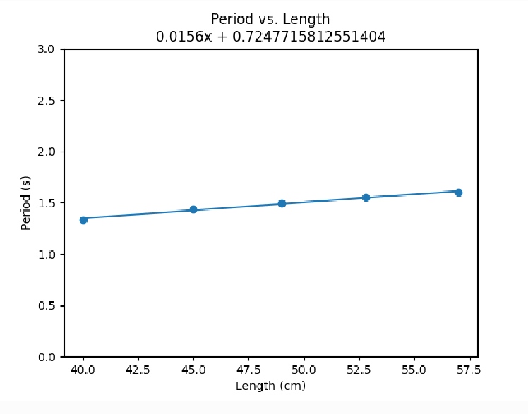

public:: true

- ### Metadata
  Date: *November 28, 2023*
  Class: *PHYS253 - Section 1*
  Author: *John White*
  Professor: *Jarod Adelman*
- # Theory
	- ## Primary Objectives
	  In this lab, we will...
	  * Practice equation substitution to solve for different variables in terms of other variables
	  * 
	  * Calculate the error percentages between a calculated and measured value
- # Data
	- ## Angular Exercise
	  |**Angle (deg)**|**Angle (rad)**|**sin(theta)**|
	  |3|0.05|0.05|
	  |6|0.10|0.10|
	  |9|0.16|0.16|
	  |12|0.21|0.21|
	  |15|0.26|0.26|
	  |18|0.31|0.31|
	  |21|0.37|0.36|
	  |24|0.42|0.41|
	  |27|0.47|0.45|
	  |30|0.52|0.50|
	- ## Period vs. Mass
	  |**Mass (g)**|**Avg Period (s)**|
	  |100|1.3384|
	  |150|1.3444|
	  |200|1.3464|
	  |250|1.3606|
	  
	- ## Period vs. Angular Displacement
	  |**Angle (\deg)**|**Period (s)**|
	  |5|1.3276|
	  |10|1.3214|
	  |15|1.3276|
	  |20|1.331|
	  
	- ## Period Squared vs. Length
	  |**Length (cm)**|**Period (s)**|**Period Squared (s^2)**|
	  |40.0|1.334|1.779|
	  |45.0|1.437|2.064|
	  |49.0|1.498|2.244|
	  |52.8|1.553|2.412|
	  |57.0|1.600|2.560|
	   
	  
- # Results
	- ## 4.1..3 Generating Graphs
	  I used Python to create the above. I will discuss the coding process in **5.1..3 Generating Graphs**.
	- ## 4.4 Analyzing the Slope
	  After examining the equation which describes $$T^2=\frac{4\pi^2}{g}T$$, you can rewrite this to be $$\text{slope} = \frac{4\pi^2}{g}$$. This is accomplished by treating $m$ as $$\frac{T^2}{L}$$, which is a value calculated via the trendline of **Period Squared vs. Length**. From there, we can swap the dividend of the right side to create the equation which solves for little g: $$g = \frac{4\pi^2}{slope}$$.
	  
	  With this approach, gravity is calculated to be **8.60m/s^2**, which has a percent error of **12.2%** compared to 9.80m/s^2.
	-
- # Discussion
	- ## 5.1..3 Generating Graphs
	  I formatted my data as follows
- # Conclusion
  ...