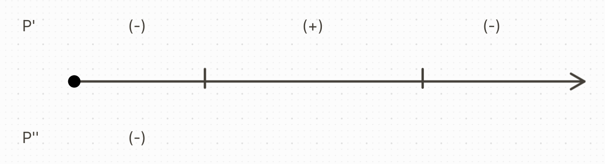

## 1. Base Equations
$$\frac{dP}{dt} = (\beta(P)-S(p))P$$
$$\frac{dP}{dt} = (a - (bP + \frac{c}{P}))P$$
$$\text{or}$$
$$-bP^2+aP-c=0$$
$$\text{or}$$
$$bP^2-aP+c=0$$
$$\text{by the quadratic formula...}$$
$$P=\frac{a\pm\sqrt{a^2-4bc}}{2b}$$
$$\text{so}$$
$$M=\frac{a+\sqrt{a^2-4bc}}{2b}$$
$$m=\frac{a-\sqrt{a^2-4bc}}{2b}$$
$$M > m$$
$$\text{so}$$
$$\frac{dP}{dt}=-b(P-M)(P-m)$$
$$\text{so}$$
\begin{cases}
\frac{dP}{dt}=k(M-P)(P-m)\\
P(t_0) = P_0
\end{cases}
- ## 2. Sketching Representative Solutions
  **Equilibrium Solutions**:
  * P(t) = M
  * P(t) = m
  
  **Second Derivative of P**:
  $$\frac{d^2P}{dt^2}=k^2(M-P)(P-m)(m+M-2P)$$
  
  **Graphing**:
  
  *Remember to add the midpoint for the second derivative, and calculate the signs!*
- ## 3. Initial Value Problem
  \begin{cases}
  \frac{dP}{dt} = k(M-P)(P-m) \text{, (solve the IVP, as the DE is seperable)}\\
  P(t_0) = P_0
  \end{cases}
  
  **Solving**:
  $$\int\frac{dP}{(M-P)(P-m)}dP=\int kdt = kt+C$$
  $$\text{or (partial fractions)}$$
  $$A=B=\frac{1}{M-m}$$
  $$\frac{1}{M-m}(-\ln|M-P|+\ln|P-m|)$$
  $$\text{or}$$
  $$\ln|\frac{P-m}{M-P}|=(M-m)kt+C$$
  $$C=\ln|\frac{P_0-m}{M-P_0}|-(M-m)kt_0$$
  $$\text{so}$$
  $$\ln|\frac{P-m}{M-P}|=(M-m)kt+\ln|\frac{P_0-m}{M-P_0}|-(M-m)kt_0$$
  $$\text{or}$$
  $$\frac{P-m}{M-P}=\frac{P_0-m}{M-P_0}e^{k(M-m)(t-t_0)}$$
  $$\text{(solve for P, let the right side equal A(t))}$$
- ## 4. 
  $$P(t) = \frac{M(P_0-m) + m(M-B)e^{-k(M-m)(t-t_0)}}{P_0-m+(M-P_0)e^{-k(M-m)(t-t_0)}}$$
  
  We must now find the value of $t$ where $P(t) = 0$ (aka $t^{*}$)
  
  Solve the following way for t:
  $$M(P_0-m)+m(M-P_0)e^{-k(M-m)(t-t_0)}=0$$
  $$\text{or}$$
  $$-k(M-m)(t-t_0)=\ln\frac{M(m-P_0)}{m(M-P_0)}$$
  
  Next, lets determine the behavior of $P(t)$ as $t \rarr \infty$:
  $$P(t) = \frac{M(P_0-m) + m(M-B)e^{-k(M-m)(t-t_0)}}{P_0-m+(M-P_0)e^{-k(M-m)(t-t_0)}}$$
  $$\text{so}$$
  $$\lim_{t \rarr \infty}P(t) = \frac{M(P_0-m)}{P_0-m} = M$$q
- ## 5.
  $$P(t)\geq \frac{m+M}{2}, t \geq t_0$$
  
  Substitute $$P_0=\frac{m+M}{2}$$ into the equation from 4 and simplify!
  
  **Why is** $$P(t)\geq P_0=\frac{m+M}{2}$$ **for all** $$t \geq t_0$$?
  Refer to #2 and the graph, and also recall that $$P'(t) > 0\text{ if }P_0=\frac{m+M}{2}$$
  @ $$\frac{m+M}{2}, P(t) > P_0$$
- ## 6.
  There exists a table with P, \beta(P), and P\delta(P).
  
  We must use LSM