public:: true

- ### Metadata
  Date: *October 10, 2023*
  Class: *PHYS253 - Section 1*
  Author: *John White*
  Professor: *Jarod Adelman*
- # Theory
	- ## Primary Objectives
	  In this lab, we will...
	  * Practice using a sinusoidal fit on a graph
	  * Learn how springs behave depending on the mass
	  * Calculate the error percentages between a calculated and measured value
- # Data
	- ## 50g - 6cm
	  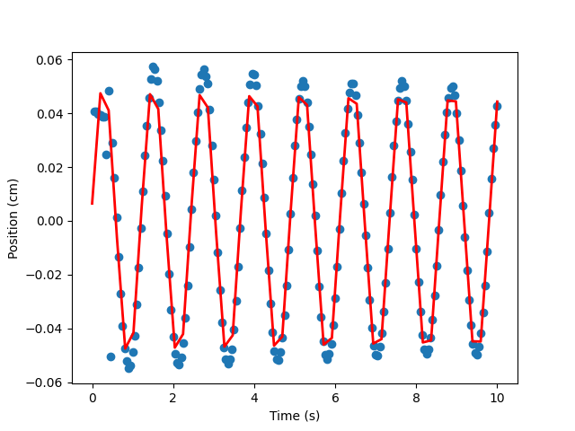
	  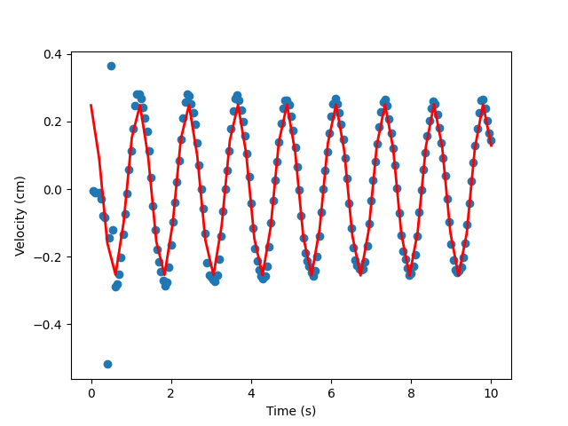
	- ## 50g - 10cm
	  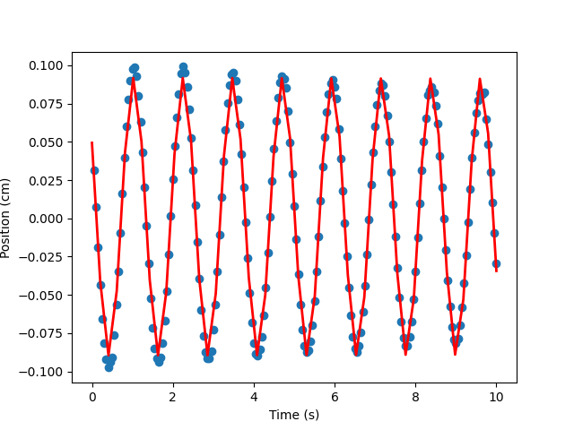
	  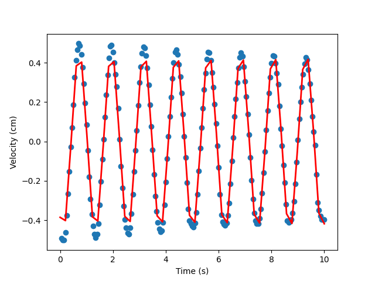
	- ## 100g - 6cm
	  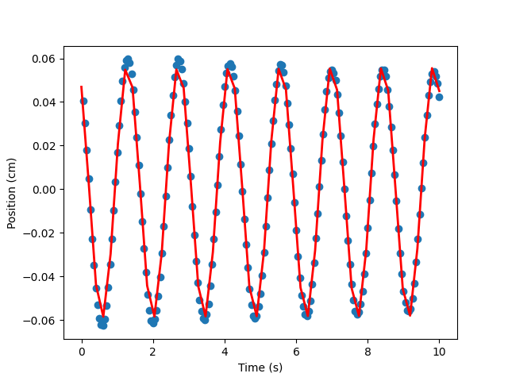
	  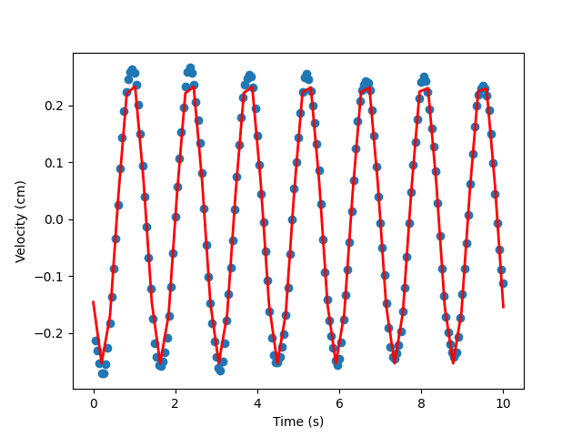
	- ## 100g - 10cm
	  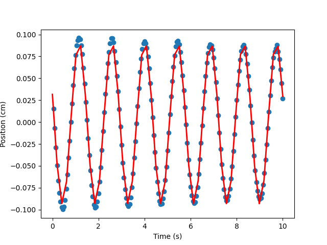
	  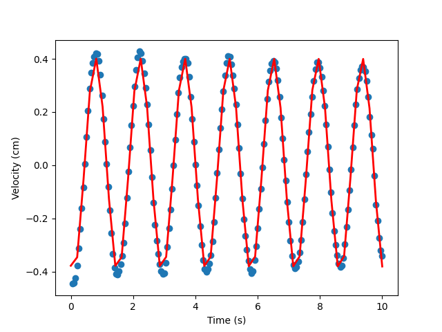
	- ## 150g - 6cm
	  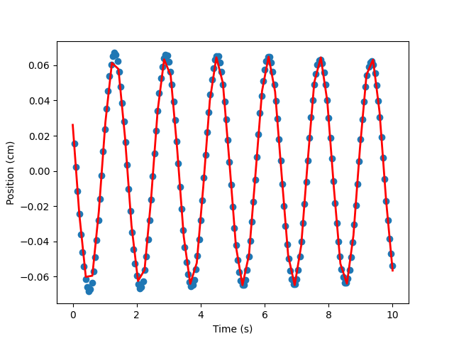
	  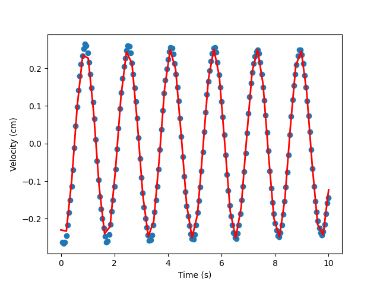
	- ## 150g - 10cm
	  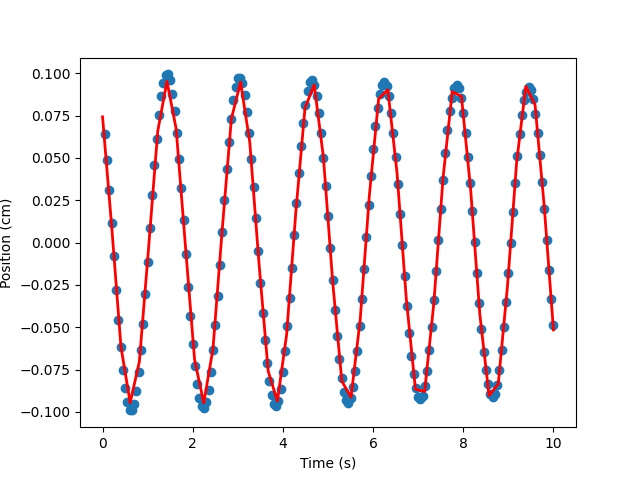
	  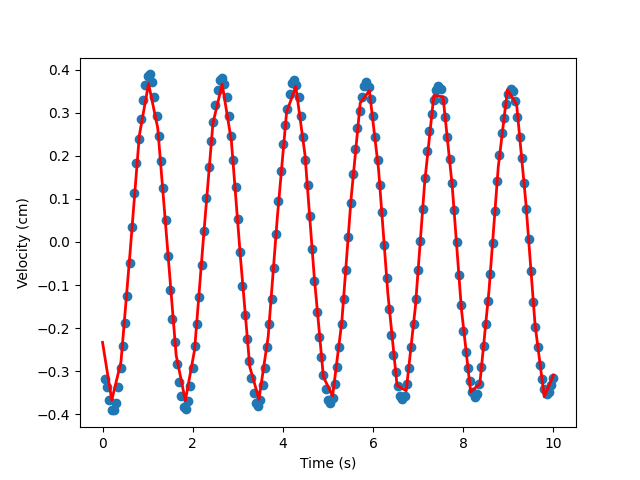
- # Results
	- ## 3.1 Graph Comparison
		- ### 3.1.1 Similarities
		  They are both sinusoidal graphs which fit perfectly with the function that the TA provided. They behave very similar to how the equations predict, albiet with some gradual decrease in amplitude, which is to be expected in an imperfect system.
		- ### 3.1.2 Differences
		  They do not have the same co-domains, the velocity has a much lower while the position is much higher due to units. They also start at difference times on the sin wave's graph.
		- ### 3.1.3 Mass Location at V = 0
		  The mass is located at either extreme of the position co-domain (peak or valley), which does line up with how the equations provided. ($$y = \sin(2\pi ft+\theta)$$ and $$v = A\omega \cos(\omega t + \theta)$$)
		- ### 3.1.4 Mass Location at $V_{max}$
		  The mass is located directly at the origin ($y = 0$), which does make sense. This is because the mass has not yet started to slow down, and the velocity is at its max right before it begins to change in direction.
	- ## 3.2 Offsets
		- ### 3.2.1 Y_0 Position vs. Mass
		  The Y_0 position is lower depending on the mass, which does make sense according to our equations and Newton's laws. Because the mass is increased, gravity has more pull against the spring, creating a lower equilibrium point.
	- ## 3.3 Data Fit
		- ### 3.3.1 Fit of Data
		  The data does fit, and is fairly consistent across all graphs. There are no objective outliers.
		- ### 3.3.2 Effect on Constants Based on Mass and A_i
			- #### Mass and A are inverse to oneanother.
			- #### A_i is relatively proportional to A.
			- #### Mass is inverse to \omega.
			- #### A_i and \omega are independent of oneanother.
			- #### Velocity and Position fits have different phase offsets.
		- ### 3.3.3 Period of Motion
		  The period of motion is entirely independent of the initial amplitude, but it is heavily impacted by the mass of the object.
		- ### 3.3.4 K Calculation
		  Depending on the mass of the object, the K constant increases drastically.
- # Discussion
  ...
- # Conclusion
  ...