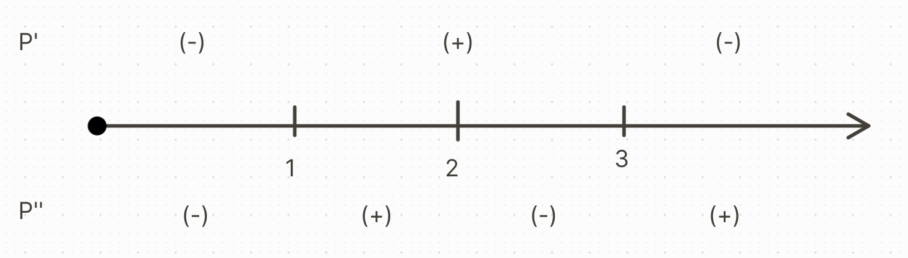

## 1 - Extinction Problem
\begin{cases}
P(t), t \geq 0\\
\beta(P) = 0.2P^{\frac{1}{2}}\\
\delta(P) = 0.1P^{\frac{1}{2}}\\
\end{cases}

\begin{cases}
\frac{dP}{dt} = (\beta(P)-\delta(P))P\\
P(0) = 100
\end{cases}

We are aiming to find **Doomsday** (when the population approaches infinity).

$$\frac{dP}{dt}=0.1P^{\frac{3}{2}}$$
$$\text{or}$$
$$P^{\frac{-1}{2}}=\frac{1}{-20}t+C$$
$$C=\frac{1}{10}$$
$$\text{so}$$
$$P=(\frac{-20}{-t+2})^2=\frac{400}{(2-t)^2}$$

We can see that a value approaching $$t = 2$$ from the left is our $$T$$, or Doomsday.
- ## 2 - Dimensional Analysis
  \begin{cases}
  P - ML^2T^{-3}\\
  \rho - ML^{-3}\\
  \mu - ML^{-1}T^{-1}\\
  D - L\\
  v - LT^{-1}
  \end{cases}
  We want to find power ($P$) in terms of the other variables.
  $$P^a\rho^b\mu^cD^dv^e=M^0L^0T^0$$
  
  \begin{cases}
  a+b+c = 0\\
  2a-3b-c+d+e = 0\\
  -3a-c-e = 0\\
  \end{cases}
  **Resulting basis vectors**:
  \begin{cases}
  a = a\\
  b = -a - c\\
  c = c\\
  d = -2a - c\\
  e=-3a-c
  \end{cases}
  \begin{equation}\begin{bmatrix}a\\b\\c\\d\\e\end{bmatrix} = a\begin{bmatrix}1\\-1\\0\\-2\\-3\end{bmatrix} + b\begin{bmatrix}0\\-1\\1\\-1\\-1\end{bmatrix}\end{equation}
  **Our complete set of dimensionless products**:
  $$\Pi_1=\frac{P}{\delta D^2V^3}$$
  $$\Pi_2=\frac{\mu}{\delta D v}$$
  By the Buckingham Theorem, there exists a function $$f$$ such that $$f(\Pi_1, \Pi_2) = 0$$.
  
  Then, by the Implicit Function Theorem, there is another function $$h$$ such that $$\Pi_1 = h(\Pi_2)$$.
  
  **Final solution**:
  $$P=\delta D^2v^3h(\frac{\mu}{\delta Dv})$$
- ## 3 - Graphical Solutions
  \begin{cases}
  \frac{dP}{dt} = (1-P)(P-3)\\
  P(0) = P_0 \geq 0
  \end{cases}
  
  **Equilibrium Solutions**:
  $$\frac{dP}{dt} = 0\text{ when }P = 1, 3$$
  $$\frac{d^2P}{dt^2} = (1-P)^2(P-3) - (1-P)(P-3)^2=(1-P)(P-3)(4-2P)$$
  $$= 0 \text{ when } P = 1,2,3$$
  
  
  **Classifying Stability**:
  $P=1$ is (US) because we can find solutions that start close to $$P=1$$, but move away as $$t\rarr \infty$$
  $P=3$ is (S) because all solutions that start close to $$P=3$$ converge to it as $$t\rarr\infty$$.
- ## 4
  \begin{cases}
  \frac{dx}{dt} = 4(y-1)\\
  \frac{dy}{dt} = x + 1
  \end{cases}
  
  From this, we can see that the equilibrium solution is $$(-1,1)$$.
  
  **Creating our differential equation**:
  $$\frac{dy}{dx} = \frac{x+1}{-4(y-1)}$$
  
  **Solving our differential equation**:
  $$\int(y-1)dy = \frac{-1}{4}\int(x+1)dx$$
  $$\text{or}$$
  $$\frac{(y-1)^2}{2}=-\frac{1}{4}\frac{(x+1)^2}{2}+C$$
  $$\text{or}$$
  $$\frac{(x+1)^2}{4}+(y-1)^2 = C$$
  
  **Graphing**:
  The above equation is the equation of an ellipse.
  
  **Calculating Directions**:
  \begin{cases}
  x > -1, y > 1 \rarr \frac{dx}{dt} < 0, \frac{dy}{dt} > 0\\
  x < -1, y > 1 \rarr \frac{dx}{dt} < 0, \frac{dy}{dt} < 0\\
  x > -1, y < 1 \rarr \frac{dx}{dt} > 0, \frac{dy}{dt} > 0\\
  x < -1, y < 1 \rarr \frac{dx}{dt} > 0, \frac{dy}{dt} < 0
  \end{cases}
  
  **Stability**:
  $$(-1,1)$$ is (S) because any solution that starts close to $$(-1,1)$$ stays close as $$t \rarr \infty$$.
- ## 5
  \begin{cases}
  T=4, Q = 1\\
  R_1, R_2 = ?
  \end{cases}
  \begin{cases}
  \frac{dC}{dt} = -C^2\\
  C(0) = 1 = Q
  \end{cases}
  
  **Building our Differential Equation**:
  $$\int\frac{1}{C}dC = -\int dt$$
  $$\text{or}$$
  $$C=\frac{1}{t+K}$$
  
  **First Period [0,4]**:
  **Solving for K**:
  $$C(0) = 1 = \frac{1}{0+K}$$
  $$\text{so}$$
  $$K = 1$$
  
  **First Residual**:
  $$R_1 = \frac{1}{4+1} = \frac{1}{5}$$
  
  **Next Period [4, 8]**:
  $$C(4) = Q + R_1 = 1 + \frac{1}{5} = \frac{6}{5}$$
  $$R_2 = C(8)$$
  
  **Solving for K**:
  $$\frac{6}{5}=\frac{1}{4+k}$$
  $$\text{or}$$
  $$K = \frac{5}{6} - \frac{-24}{6} = -\frac{-19}{6}$$
  $$\text{so}$$
  $$C(t) = \frac{6}{6t - 19}$$
  
  **Second Residual**:
  $$C(8) = \frac{6}{6(8) - 19} = \frac{6}{29}$$
- ## 6
  * *x* - # of desks ($3)
  * *y* - # of tables ($4)
  
  ||A|B|C|
  |x|2.5|3|1|
  |y|1|3|2|
  |max per week|20|30|16|
  
  \begin{cases}
  P(x,y) = 3x + 4y\\
  2.5x + y \leq 20\\
  3x + 3y \leq 30\\
  x + 2y \leq 16\\
  x \geq 0\\
  y \geq 0
  \end{cases}